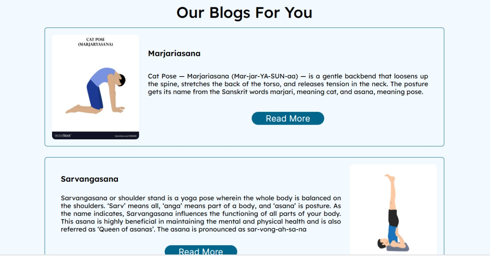
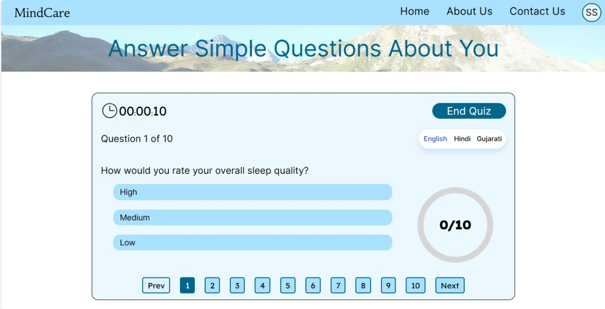
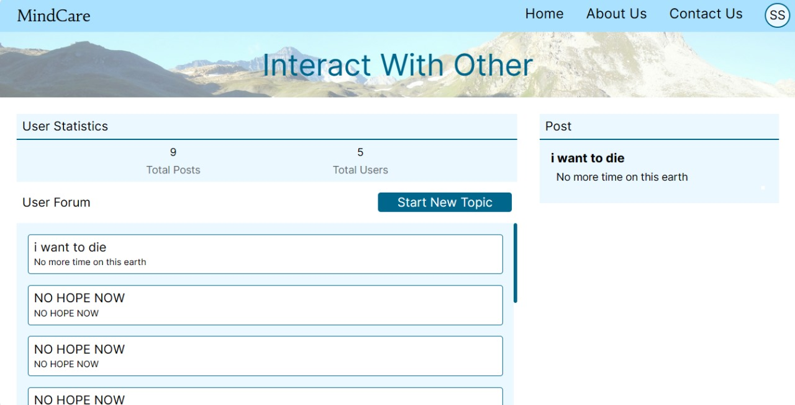
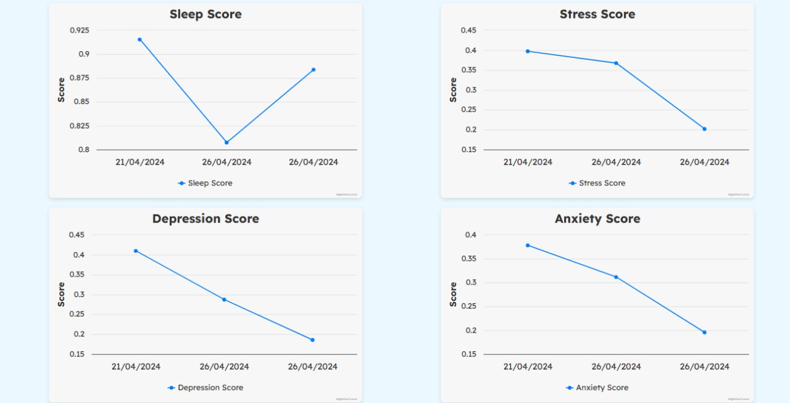

# MindCare

MindCare is a project dedicated to raising awareness about mental health issues and providing support through personalized recommendations and an interactive platform.

## Table of Contents
- [Description](#description)
- [About](#about)
- [Team Members](#team-members)
- [Features](#features)
- [Glimpse of Website](#glimpse-of-website)
- [Usage](#usage)

## Description
MindCare is designed to educate users about mental health conditions such as stress, depression, and anxiety. It offers personalized recommendations based on quizzes and provides a platform for users to interact and seek support. The project utilizes React with the Vite framework for the frontend, Django for the backend, and MongoDB as the database. Additionally, it integrates machine learning algorithms to analyze user content, identify potentially concerning posts, and intervene when necessary. This approach ensures that users receive timely support and resources tailored to their specific needs.

## About
MindCare is a web application developed to promote mental well-being and provide resources for individuals facing mental health challenges. It offers educational content, personalized recommendations, and a supportive community forum to facilitate discussion and support. The platform aims to create a safe space where users can openly share their experiences, access valuable information, and receive encouragement from peers and professionals. By leveraging technology, MindCare strives to bridge the gap between those seeking help and the resources available to them, fostering a more inclusive and supportive environment for mental health care.

## Team Members
- [Shivam Sikotra (UI21CS55)](https://github.com/ShivamSikotra11/)
- [Shyam Patel (UI21CS57)](https://github.com/shyam2024)
- [Viral Biyawala (UI21CS66)](https://github.com/ViralBiyawala)

## Features
- **Quizzes**: Assess mental health status through interactive quizzes designed by mental health professionals. These quizzes help identify symptoms of stress, depression, and anxiety, and provide a baseline for personalized recommendations.
- **Personalized Recommendations**: Based on quiz results, users receive tailored suggestions such as yoga practices, meditation techniques, and lifestyle changes that can help improve their mental health. These recommendations are designed to be practical and easy to implement in daily life.
- **Educational Content**: Access a wealth of information on various mental health topics, including the symptoms, causes, and treatments of stress, depression, and anxiety. The educational content is curated to be engaging and informative, helping users gain a better understanding of their mental health.
- **Interactive Platform**: Engage with a community of users who are also focused on improving their mental health. The platform supports real-time interactions, allowing users to share experiences, offer support, and build connections with others who understand their struggles.
- **Forum**: A dedicated space for users to discuss their mental health journeys, ask questions, and seek advice from peers and mental health professionals. The forum is moderated to ensure a safe and respectful environment for all participants.
- **Machine Learning**: Utilizes advanced machine learning algorithms to monitor user posts and detect signs of distress or harmful behavior. When such content is identified, the system can alert moderators or provide users with resources and support options to address their needs.
- **Accessibility**: Designed with inclusivity in mind, MindCare includes features that ensure accessibility for users with disabilities.
- **Responsive Design**: Optimized for seamless viewing and interaction across all devices, including desktops, tablets, and smartphones. This ensures that users can access MindCare's resources and community support wherever they are.

## Glimpse of Website

### Blogs

### Quiz

### Interaction Page

### Graphs on Profile Page

## Usage
### Live Link : https://mindcare-sable.vercel.app/

### Steps :
1. Registration and Login: Create a new account or log in to access your existing account.
2. Home Page Tour: Follow the guided tour to familiarize yourself with the website's features.
3. Taking the Quiz: Complete the mental health quiz to receive personalized recommendations.
4. Viewing Suggestions: Explore general insights and solutions for stress, depression, and anxiety.
5. Interacting with the Community: Post, read, like, and comment on user posts to engage with the community.
6. Receiving Alerts: The system monitors posts for concerning content and alerts appropriate parties.
7. Profile Management: View and update your profile information and track your quiz history.
8. Logging Out: Securely log out of your account when finished using the website.

## Installation
Clone the repository using `git clone https://github.com/ShivamSikotra11/MHA.git`.

### Backend
1. Navigate to the `backend` directory.
2. Install dependencies using `pip install -r requirements.txt`.
3. Start the Django server using `python manage.py runserver`.

### Frontend  
1. Navigate to the `frontend` directory.
2. Install dependencies using `npm install`.
3. Start the Vite development server using `npm run dev`.
